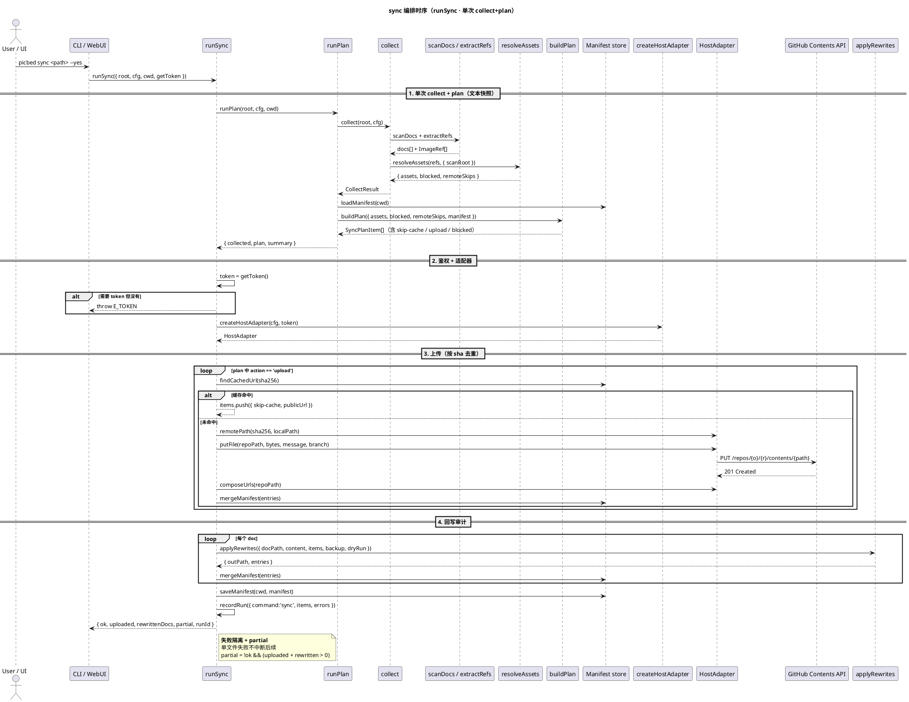

# app 应用编排层详细设计（共享）

> 性质：**跨限界上下文的共享应用层**，不是新的限界上下文，**不新增 F、不改任何 AC**。
> 服务对象：CLI 呈现（cliops 命令路径 F1–F15）与 Web/桌面呈现（webui/desktop F16–F24）。
> 架构见 [`../architecture.md`](../architecture.md)；定义见 [`../features-index.md`](../features-index.md)；全局契约见 [`cross-cutting.md`](cross-cutting.md)。
> 缘起：2026-09-27 架构评审发现 `src/cli.ts` 与 `src/ui/{ops,doctor,revert}.ts` 双份实现 scan/plan/sync/revert/config 编排，并已发生漂移（doctor 对 `local` host 误要求 token；plan item 字段不一致；`url.style` 校验只在 Web 侧；RunRecord 只由 Web 写）。

## 目的

把「一次 scan / plan / sync / revert / doctor / config 的完整编排」收敛为**唯一实现**，两个呈现层只做协议适配：

- CLI：argv → 应用服务 → JSON 信封 / 退出码 / 人类可读输出
- Web：HTTP 请求 → 应用服务 → JSON 信封 / HTTP 状态码

## 边界原则

- **零呈现依赖**：不 import `node:http`、不 import `commander`、不读写 `process.argv`、不渲染 HTML。
- **不重写域规则**：抽取/上传/回写/去重仍以 ingest/transfer/rewrite 为唯一权威；app 只编排调用。
- **错误单一来源**：编排失败统一为 `AppError { code, exitCode, path?, hint? }`；CLI 退出码与 Web HTTP 状态码由同一张表派生（见 §错误映射）。
- **Token 不落盘**：app 只经注入的 `getToken()` 取 token；RunRecord / warnings / errors 不含 secret。
- **确认门属呈现层**：CLI `--yes`、HTTP `confirm` 由呈现层判定；app 暴露 `runSync` / `runRevert` 等**无确认参数**的写服务。
- **呈现层只经 façade 取配置与鉴权（2026-10-02 补）**：`app/settings.ts#resolvedConfig` 与 `app/auth.ts`（`currentToken` / `saveUserToken` / `clearSavedToken` / `probeGh` / `startGhLogin`）。CLI / WebUI **不得**直接 import `config.ts` / `user-token.ts` / `infra/gh-cli.ts`——此前 `ui/server.ts` 三处直连，绕过了统一错误码与日志脱敏。
- **写操作一律有 app 入口（2026-10-02 补）**：`picbed upload` 的上传编排下沉到 `app/upload.ts#uploadSingleAsset`；CLI 只做参数校验与 `AppError → 退出码`。呈现层不得直接 `createHostAdapter` / `uploadAsset`。防回归见 `tests/layering.test.ts`。

## 模块文件夹结构（实现落点）

```
src/app/
├─ errors.ts     # AppError + code → exitCode → HTTP 表
├─ collect.ts    # 扫描文档 + 抽取 + 解析去重（ingest 域编排）
├─ plan.ts       # runPlan / summarizePlan / publicPlanItem
├─ sync.ts       # runSync（上传 + 回写 + manifest + RunRecord）
├─ revert.ts     # runRevert / listManifestView
├─ doctor.ts     # doctorService（host-aware）/ publicConfig
├─ config.ts     # readConfigKey / writeConfigKey（含 url.style 校验）
└─ runs.ts       # RunRecorder：newRunId / recordRun / listRuns / getRun
```

## 服务清单

| 服务 | 职责 | 调用方 |
|------|------|--------|
| `collect(root, cfg)` | scanDocs → extractRefs → resolveAssets → `{docs, byDoc, assets, blocked, remoteSkips, warnings}` | plan / sync |
| `runPlan(root, cfg, cwd)` | collect + manifest + buildPlan → `{collected, plan, summary}` | CLI scan/plan/sync-dryRun；API `/api/plan`、`/api/scan`、`/api/sync` (dryRun) |
| `publicPlanItem(it)` | plan item 公开投影（**含 localPath**） | 同上 |
| `runSync({root,cfg,cwd,getToken,command})` | 调用时**单次 collect+plan**（上传与回写共用同一文本快照，不复用调用方先前 plan）→ 上传（cache 命中跳过）→ 回写 → 保存 manifest → 写 RunRecord | CLI `sync`；API `/api/sync`；watch auto |
| `runRevert({root,cfg,cwd,dryRun,command})` | manifest 校验 → 逐文档 revert（dry-run 进 `planned`）→ 写 RunRecord | CLI `revert`；API `/api/revert` |
| `listManifestView(cwd)` | manifest 只读视图（无 token） | API `/api/manifest` |
| `doctorService({cfg,getToken,probeApi})` | host-aware 检查：github 校验 owner/repo/branch + token + API 探测；local 只校验 host | CLI `doctor`；API `/api/doctor` |
| `publicConfig(cfg, extra?)` | 配置视图（token 掩码） | CLI `config list`；API `/api/config` |
| `readConfigKey` / `writeConfigKey` | 键枚举 + **url.style 校验** + TOML 改写 | CLI `config get/set`；API `/api/config` |
| `runs.ts`（RunRecorder） | `./.picbed/runs/*.json` 追加 / 读取 | CLI 与 Web 共用（审计 F21） |

## 复杂任务：sync 编排链（为什么必须画出来）

`runSync` 是唯一一次同时触碰「读取文本 → 网络写 → 本地写 → 审计」的服务，而其中**文本快照只能取一次**（§行为增量 7）。这条约束在单个服务描述里看不出来，因此画出全链路：



由这张图得出的规则：

1. **上传与回写共用同一份 `CollectResult`**：时刻 1 只做一次 scan/extract/resolve，之后不再重扫——这就是 §行为增量 7 的"同一文本快照"，也是为什么 `runSync` 不接受调用方传入的 plan 结果。
2. **鉴权失败发生在任何写之前**：`E_TOKEN` 在阶段 2 抛出，此时还没 PUT 也没改文档，故失败可安全重试。
3. **manifest 是两次写的中间层**：先把每个 asset 的 URL `mergeManifest` 进内存，最后才 `saveManifest`——对应"每次 run 最多一次 manifest 保存"（§不变式 2）。
4. **partial 由 (uploaded+rewritten) 判定**，与具体错误数无关，保证 CLI 退出码 6 与 Web 207 同源。

## 错误映射（单一来源）

| code | 含义 | 退出码 | HTTP |
|------|------|--------|------|
| `E_CONFIRM` | 缺确认 | 7 | 409 |
| `E_TOKEN` / `E_AUTH` | 缺 token / 鉴权失败 | 3 | 401 |
| `E_CONFIG` | 配置不完整（如 `github.owner/repo` 缺失） | 3 | 400 |
| `E_USAGE` / `E_STYLE` | 用法 / 枚举非法 | 2 | 400 |
| `E_NO_ROOT` / `E_ROOT` / `E_PATH*` / `E_DOC_EXT` / `E_MANIFEST_CORRUPT` | 本地文件与路径类 | 4 | 400 |
| `E_REMOTE` | 远端 API 失败 | 5 | 502 |
| `E_PARTIAL` | 部分成功 | 6 | 207 |

规则：退出码以 [`cross-cutting.md`](cross-cutting.md) §1 为唯一权威；HTTP 状态码是语义近似，**以信封 `error.code` 为准**。

## 行为增量（统一后 CLI 与 Web 语义对齐）

1. **RunRecord 共享**：CLI `sync` / `revert` 也写 `./.picbed/runs/`（command 为 `sync` / `revert` / `revert.dryRun`；Web 仍 `api.*`）。
2. **doctor host-aware**：`host.type=local` 时不再要求 token、不探测 GitHub API（消除 CLI 与 Web 漂移）；github 仍为 owner/repo/branch + token + API 检查。
3. **url.style 校验单一来源**：只在 `writeConfigKey`；CLI 与 Web 同等拒绝非法枚举（退出码 2 语义 / HTTP 400）。
4. **plan item 投影统一含 `localPath`**（CLI 原缺）：JSON `data` 只增字段，action 分类与退出码不变。
5. **revert dry-run 明确分流**：`planned[]`=将改文档，`rewritten[]`=已写文档；CLI `revert --dry-run` 输出相应改为 `planned`。
6. **revert manifest 损坏**：显式返回 `errorCode='E_MANIFEST_CORRUPT'`（Web 不再依赖错误字符串匹配）；CLI 退出码 1 → 4（本地文件类）。
7. **sync 单次 collect+plan（同一文本快照）**：`runSync` 在调用时自行执行一次 collect+plan，上传与回写共用该次快照，**不复用调用方先前的 dry-run / plan 结果**；CLI 与 Web 由此走同一条写路径，不再各自预扫。app 不承诺「写阶段重扫」「防 plan 与写之间外部改动」这类更强语义。
8. **partial 判定单一来源**：`partial = !ok && (uploaded + rewritten > 0)`（CLI 退出码 6 / Web 207 同一判定）。

## 不变式

1. app 层不 import `node:http`、`commander`，不读写 `process.argv`。
2. 每次 run 最多一次 manifest 保存；图片字节只读。
3. RunRecord / warnings / errors 不含 token 明文。
4. 呈现层不得重写 action 分类、退出码或确认门语义。

## 测试对齐

| 测试 | 对齐 |
|------|------|
| tests/ui.test.ts F18、tests/ui-panels.test.ts F19–F22 | 应用服务 + HTTP 信封 |
| tests/mcp.test.ts | CLI `--json`（经 app 层）退出码 0 |
| 契约断言：plan item 含 `localPath`、revert `errorCode` | 新增 / 更新 |
| 设计文档校验 | `npm run validate:design`（`scripts/validate.mjs --profile=design`）要求本文件存在 |

## 功能点映射

本层不新增 F、不改 AC；按「实现归属（应用）」被下列功能点共用：
F1/F2/F10/F12（CLI 路径）、F16–F22（Web 路径）、F24（桌面壳复用 Web 服务）。
各 F 的 AC 与模块归属仍以 [`../features-index.md`](../features-index.md) 为准（cliops / webui）。

*app 只负责「把域能力编成一次可复现的运行」；域规则看 ingest/transfer/rewrite，全局形态看 cross-cutting。*
