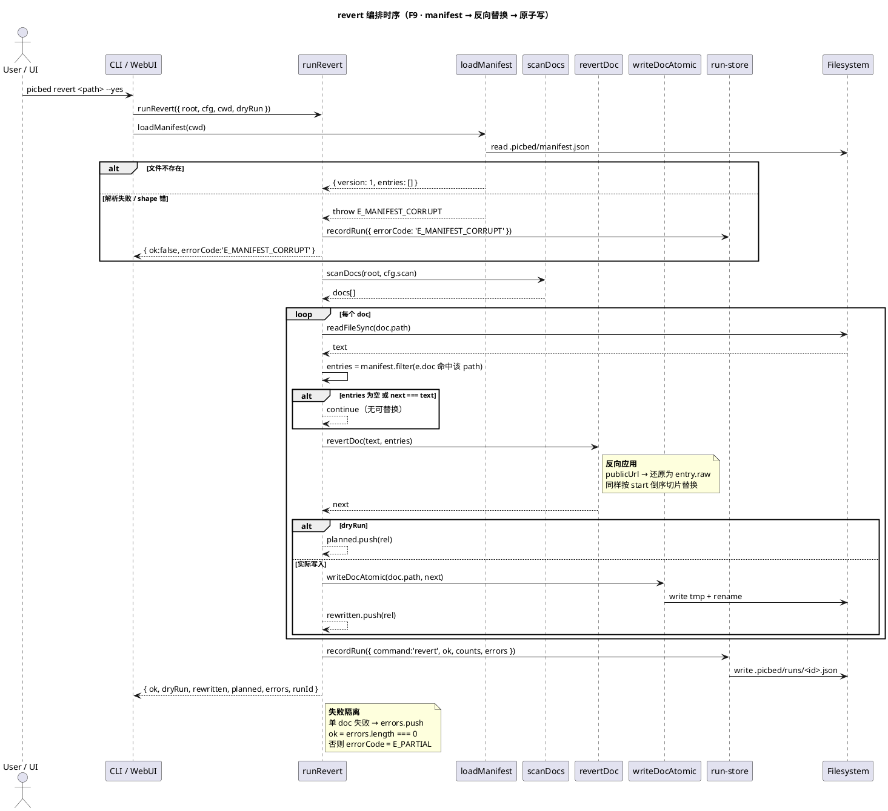

# rewrite 模块详细设计

> 归属功能点：F8 文档链接回写、F9 Manifest 与 revert。
> 架构见 [`../architecture.md`](../architecture.md)；定义见 [`../features-index.md`](../features-index.md)；ingest 锚点见 [`module-ingest.md`](module-ingest.md)；横切见 [`cross-cutting.md`](cross-cutting.md)。

## 目的

rewrite 把文档中的本地图片引用**精确替换**为图床 URL，并维护可审计、可回滚的 **manifest**。只改 URL 子串，保证语义与排版稳定。

边界原则：
- **不上传**、**不抽取新引用**；输入是已有 `ImageRef` 锚点 + `localPath→publicUrl` 映射。
- **不改图片文件**。
- 默认原地回写；`--out-dir` 写副本。

## 模块文件夹结构（栈无关）

```
rewrite/
├─ domain/
│  ├─ cqe/          # RewriteDocsQuery、RevertDocsQuery
│  ├─ entity/       # Manifest、ManifestEntry、RewriteResult
│  ├─ service/      # LinkRewriter、ManifestStore、BackupWriter
│  └─ facade/       # RewriteFacade
├─ exceptions/      # AtomicWriteError、ManifestCorruptError
└─ persistence/file/ # manifest.json 读写、backup 目录
```

## 数据

```
Manifest {
  version: 1,
  entries: ManifestEntry[]
}
ManifestEntry {
  doc, raw, localPath, sha256, publicUrl, updatedAt
}
```

**不变量**：manifest **不得**包含 token 或任何 secret。

## F8 文档链接回写

1. 按 `ImageRef.start/end` **从后往前**切片替换，避免偏移失效。  
2. 仅替换 URL 子串；alt/title/srcset 其它候选保留。  
3. 代码块内 ref 本不应存在（ingest F4）；rewrite 二次断言不越界。  
4. 原子写：`*.tmp` + rename；失败不破坏原文件。  
5. 默认写 `.picbed/backup/<doc>.<ts>.bak`；`--no-backup` 关闭。  
6. `--out-dir`：保持相对目录结构写入副本，源文档不动。

## F9 Manifest 与 revert

- 每次成功替换 upsert 一条 entry（同 doc+raw+sha 更新 publicUrl）。  
- `revert`：对文档内仍匹配 `publicUrl` 的子串写回 `raw`（本地路径）。  
- `revert --dry-run`：只报告将还原的条目。  
- manifest 损坏：报 `ManifestCorruptError`，不静默清空（可 `--force-new-manifest` 显式重建，属写操作需 `--yes`）。

revert 要串起 manifest 读取、扫描、反向替换、原子写、run 记录五件事，且**损坏的 manifest 必须立即失败而非静默重建**，这条约束只有在时序里才看得清楚：



由这张图得出的规则：

1. **`dryRun` 只替换最后一步**：分叉点在 `writeDocAtomic` 之前——扫描与替换计算照做，只有实际写入换成 `planned.push`，所以 dry-run 报出的清单与实际执行必然一致。
2. **`next === text` 视为无改动**：不写入、不入 `rewritten`，避免 mtime 变动与假计数。
3. **单 doc 失败不影响其他文档**，最终以 `E_PARTIAL` 表达部分成功（退出码 6 / HTTP 207，映射见 [`module-app.md`](module-app.md) §错误映射）。
4. **manifest 损坏先写 RunRecord 再返回**：revert 即使失败也留下审计痕迹（F21），这也是 `E_MANIFEST_CORRUPT` 必须是显式错误码而非字符串匹配的原因。

## 功能点映射

| F | 本模块章节 |
|---|------------|
| [F8](../features-index.md#f8-文档链接回写) | §F8 |
| [F9](../features-index.md#f9-manifest-与-revert) | §F9 |

*回写正确性 AC 以 features-index 为准。*
