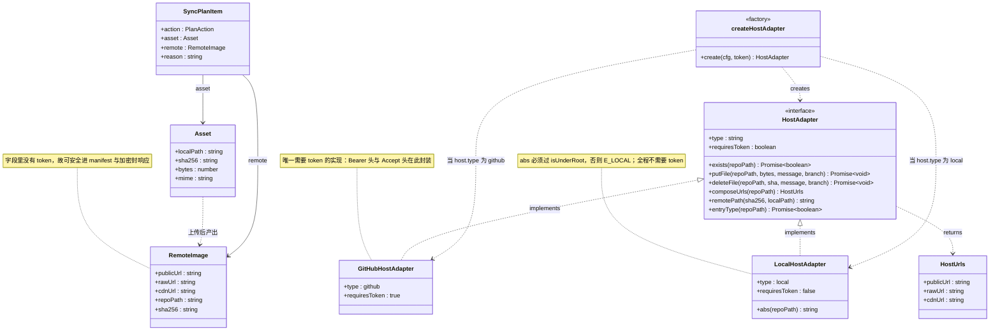
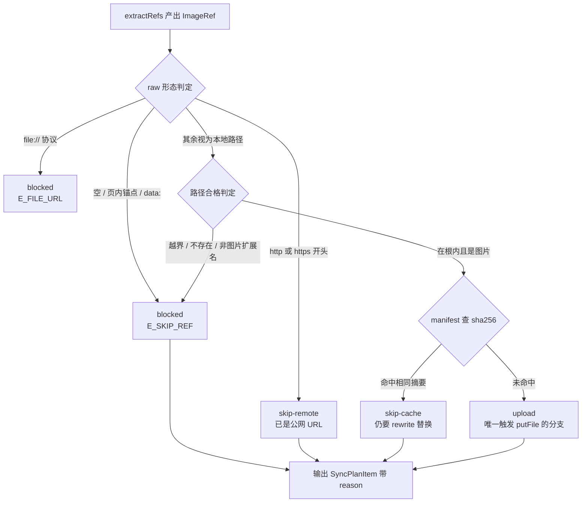

# transfer 模块详细设计

> 归属功能点：F6 上传计划 plan、F7 GitHub 图床上传、F11 单文件上传。
> 架构见 [`../architecture.md`](../architecture.md)；定义见 [`../features-index.md`](../features-index.md)；ingest 见 [`module-ingest.md`](module-ingest.md)；横切见 [`cross-cutting.md`](cross-cutting.md)。
> 栈无关；Host 细节经 `HostAdapter` 端口注入（F13：github | local）。

## 目的

transfer 将 ingest 产出的 `Asset` 变为可写回的 `RemoteImage`：先形成**可预览计划**，再经 **GitHub Contents API**（PicX 同源模型）上传，并按 URL 风格生成公开链接。只读缓存决定跳过，保证幂等。

边界原则：
- **不改文档文本**（rewrite 职责）。
- **不读目录发明引用**（ingest 职责）；可接受单文件路径（F11）。
- Token 仅在适配器边界注入，不进入领域结果对象。
- **适配器经端口取用（2026-10-02 补）**：编排层只用 `host/index.js` 的端口工厂 `createHostAdapter`，**不**深连 `host/github.js` / `host/local.js`。目录能力（F20）是端口上的**可选能力** `HostAdapter.entryType?()`——GitHub 经 Contents API 实现，其它后端可不实现，编排层须先判空并报 `E_CONFIG`。

## 模块文件夹结构（栈无关）

```
transfer/
├─ domain/
│  ├─ cqe/          # BuildPlanQuery、UploadAssetsQuery、UploadOneQuery
│  ├─ entity/       # SyncPlan、SyncPlanItem、RemoteImage
│  ├─ service/      # PlanBuilder、UrlComposer、UploadScheduler
│  ├─ port/         # HostAdapter <<interface>>
│  └─ facade/       # TransferFacade
├─ packages/        # 防腐层：GitHubHostAdapter（Contents API）
└─ exceptions/      # UploadFailedError、RateLimitedError、HostAuthError
```

## 端口

```
HostAdapter
  type / requiresToken
  exists(repoPath): boolean
  putFile(repoPath, bytes, message, branch): void
  composeUrls(repoPath): { publicUrl, rawUrl, cdnUrl? }
  remotePath(sha256, localPath, now?): string
  # 实现负责传输语义；uploadAsset 只依赖本端口（AC7 稳定）
```

工厂：`createHostAdapter(cfg, token?)` 按 `host.type` 选择后端。

契约速览即上文代码块；下图把**端口 + 两个实现 + 工厂 + 传输数据契约**放在一张图里，用于确认「换后端要动哪些文件」：



由这张图得出的边界：

1. **编排层只认两处**：`createHostAdapter` 工厂与 `HostAdapter` 接口。图里 `GitHubHostAdapter` / `LocalHostAdapter` 对上层是**不可见的实现细节**——`tests/layering.test.ts` 禁止 `app/*` 与呈现层深连 `host/github.ts` / `host/local.ts`。
2. **token 只活在适配器内**：`GitHubHostAdapter.requiresToken = true` 是唯一要求 token 的地方，`RemoteImage` / `SyncPlanItem` 的字段里也没有 token——配合 §数据的 manifest 不变量与 `E_TOKEN` 前置校验，保证凭据不流入结果对象。
3. **`entryType?` 是可选能力**：只有 GitHub 实现了目录项判定（Contents API），`local` 可不实现；图上的 `?` 就是调用方的判空义务，未实现时报 `E_CONFIG`（F20 远程目录浏览的 fallback 依据）。

## 数据

```
SyncPlanItem { action: upload|skip-cache|skip-remote|rewrite-only|blocked,
               asset?, remote?, reason? }
RemoteImage  { publicUrl, rawUrl, cdnUrl?, repoPath, sha256 }
```

## F6 上传计划 plan

分类规则：
| 条件 | action |
|------|--------|
| manifest/cache 命中且策略允许复用 | `skip-cache` |
| ref 已是 http(s) | `skip-remote` |
| 本地 Asset 合法 | `upload` |
| 解析失败/越界 | `blocked` |
| 已远程、仅需替换（可选策略） | `rewrite-only` |

`plan` 与 `sync --dry-run` **不得**调用 `putFile`。

上表是「条件 → action」的平铺；真正实现时判定有**先后顺序**（先看 raw 形态，再查缓存），一条 ref 只会落在叶子状态之一。决策顺序本身就是规则，故给出状态转移图：



由这张图得出的规则：

1. **`upload` 是唯一触碰网络的分支**——`plan` / `sync --dry-run` 只要走到 Miss 之前就返回，因此"`plan` 不得调用 `putFile`"是**结构性保证**而非约定（`buildPlan` 不持有 adapter 实例）。
2. **`skip-cache` 也要 rewrite**：命中缓存省的是 PUT，不是替换——否则文档仍指向本地路径。
3. **`blocked` 不写任何东西**：既不上传也不替换，只在输出里带 `reason`，供 UI 打 FAIL 标签。
4. **越界与 disciplines 判定先于 sha256**：`isUnderRoot` 与扩展名白名单在 `lib/paths.ts` / `lib/img.ts`（跨层单点），不在此重复实现。

## F7 GitHub 图床上传

- 远端路径模板：`{dir}/{yyyy}/{mm}/{sha12}-{safeName}`（可配置）。
- API：`GET contents` 探测 → `PUT contents` `{message, content: base64, branch}`；已存在同内容可 skip 或带 `sha` 更新策略（默认 skip）。
- URL（`url.style`）：
  - `raw` → `https://raw.githubusercontent.com/{owner}/{repo}/{branch}/{path}`
  - `jsdelivr` → `https://cdn.jsdelivr.net/gh/{owner}/{repo}@{branch}/{path}`
  - `custom` → 用户模板
- 并发默认 2–3；429/403 指数退避；耗尽 → `RateLimitedError`（退出码 5）。
- 单文件失败隔离；汇总 partial（退出码 6）。

## F11 单文件上传

- `upload <file>`：resolve 单文件 → 与 F7 同一适配器与 UrlComposer → 输出 `publicUrl`。
- 可选写入 manifest 以便后续 sync 复用。

## F13 多图床适配器

- `host.type = "github"`：Contents API（默认，需 token）。
- `host.type = "local"`：本地目录图床（`local.root` + `local.public_base`），**无需 token**。
- 新增后端：实现 `HostAdapter` 并在工厂注册即可；plan/rewrite/manifest 无需改动。
- AC7（F7）语义保持：同 sha 幂等、URL 风格可配、失败映射退出码 5/6。

## 功能点映射

| F | 本模块章节 |
|---|------------|
| [F6](../features-index.md#f6-上传计划-plan) | §F6 |
| [F7](../features-index.md#f7-github-图床上传) | §F7 |
| [F11](../features-index.md#f11-单文件上传) | §F11 |
| [F13](../features-index.md#f13-多图床适配器) | §F13 |

*AC 以 features-index 为准；HTTP 形状以本模块 + cross-cutting 为准。*
